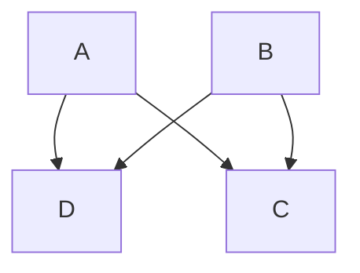
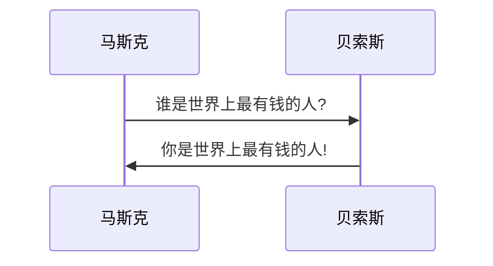
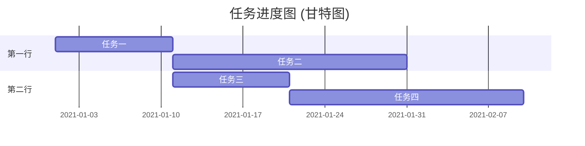

# Markdown 语法
## 2级标题 (N级标题类似)

**加粗**  *倾斜*  ~~删除~~  `短代码`  

@用户名

[链接](https://github.com/tesla-cat)
[发邮件](mailto:416640656@qq.com)

参考[^注释1]
[^注释1]:
    注释会出现在文末, 支持多行
    $x = 1$
    ```python
    x = 1
    ```


自定义图片
<!-- 注释:  高度: 100像素;  边框半径: 30像素;     边距: 纵向10像素 横向200像素 -->


视频 
- 支持网页: youtube, bilibili 等等, 可尝试直接粘贴视频网页链接
- 支持文件: mp4 等等, 可尝试直接粘贴视频文件链接

https://www.youtube.com/watch?v=rsCul1sp4hQ&t=34s

https://www.bilibili.com/video/BV1YJ411y7nq?from=search&seid=7474571802292441079

https://tesla-cat.github.io/site/files/videos/Musical_DRSSTC.mp4

表情 😄 😆 😵 😭 😰 😅  😢 😤 😍 😌 👍 👎 💯 👏 🔔 🎁 ❓ 💣 ❤️ ☕️ 🌀 🙇 💋 🙏 💢

- 无序列表
  - 无序列表

1. 有序列表
    2. 有序列表

- [x] 已完成任务
- [ ] 未完成任务

> 引用

```python
print('python 代码!')
```

```js
console.log('js 代码!')
```

表格标题1 | 表格标题2
---      | ---
表格内容1 | 表格内容2 

<details>
<summary>可展开!</summary>
隐藏内容
</details>

$ x = r \cos \alpha $
$$ \alpha = \cos^{-1} { x \over r } $$

```mindmap
- 思维导图
  - 是不是
    - 很酷?
  - 是
    - 非常酷!
```

关系图


时序图




```echarts
{
  "title": { "text": "标题" }, "tooltip": {},
  "xAxis": { "data": ["a","b","c"] },
  "yAxis": {},
  "series": [
    { "type": "bar", "data": [1, 2, 1]},
    { "type": "line", "data": [1, 2, 1], "smooth": true }
  ]
}
```

```abc
X:1
T:五线谱
M:4/4
C:Trad.
K:G
|:GABc dedB|dedB dedB|c2ec B2dB|c2A2 A2BA|
  GABc dedB|dedB dedB|c2ec B2dB|A2F2 G4:|
```

